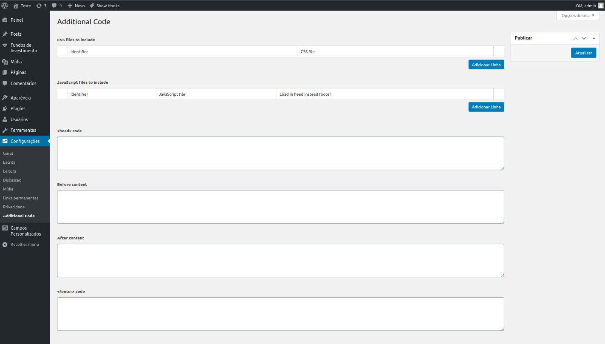

# Wordpress User Code
### Add custom code to your Wordpress website

Add additional CSS files and JS files to your Wordpress site without editing current theme or creating a child theme. Supports global files or per page/post.

Also add custom HTML code directly to your site in different places, as you need.